# Full Game Flow — Poker ZK on Stellar

**Detailed Game Flow Specification v2.0**

> **Alignment:** Full Texas Hold'em: Small Blind + Big Blind, 4 betting rounds (Pre-Flop, Flop, Turn, River), Fold / Check / Call / Raise actions, progressive board (0 → 3 → 4 → 5 cards).

---

## Table of contents

1. [Overview](#1-overview)
2. [Phase 1: Join Game](#2-phase-1-join-game)
3. [Phase 2: Shuffle (Commit-Reveal)](#3-phase-2-shuffle-commit-reveal)
4. [Phase 3: Deal Cards](#4-phase-3-deal-cards)
5. [Phase 4: Post Blinds](#5-phase-4-post-blinds)
6. [Phase 5: Betting (Pre-Flop, Flop, Turn, River)](#6-phase-5-betting-pre-flop-flop-turn-river)
7. [Phase 6: Showdown](#7-phase-6-showdown)
8. [Phase 7: Payout](#8-phase-7-payout)
9. [Alternative flows](#9-alternative-flows)
10. [State Transitions](#10-state-transitions)
11. [Error Handling](#11-error-handling)

---

## 1. Overview

### 1.1 Full timeline

```
TOTAL GAME TIME: ~2-4 minutes (depending on actions)

┌──────────────────────────────────────────────────────────┐
│              POKER ZK GAME FLOW (GOVERNOR STYLE)          │
└──────────────────────────────────────────────────────────┘

PHASE 1: JOIN GAME (~10s)
├─ P1 creates game (buy-in + config SB/BB)
└─ P2 joins

PHASE 2: SHUFFLE (~20s)
├─ P1/P2 commit seed
└─ P1/P2 reveal seed → final_seed

PHASE 3: DEAL CARDS (<1s)
└─ Derive deck from seed (hole 2+2, board 5)

PHASE 4: POST BLINDS (~5s)
└─ Collect Small Blind + Big Blind (e.g. 5 / 10 XLM)

PHASE 5: PRE-FLOP (~20-60s)
└─ Betting round (Fold / Check / Call / Raise)
   First to act: player after BB (heads-up = BB acts first pre-flop)

PHASE 6: FLOP (~5s)
└─ Reveal 3 community cards (on-chain board_revealed = 3)

PHASE 7: FLOP BETTING (~20-60s)
└─ Betting round (Fold / Check / Call / Raise)

PHASE 8: TURN (~5s)
└─ Reveal 4th community card (board_revealed = 4)

PHASE 9: TURN BETTING (~20-60s)
└─ Betting round

PHASE 10: RIVER (~5s)
└─ Reveal 5th card (board_revealed = 5)

PHASE 11: RIVER BETTING (~20-60s)
└─ Final betting round

PHASE 12: SHOWDOWN (~30-40s)
├─ P1/P2 reveal hand (rank proof)
└─ Compare hand rank → winner

PHASE 13: PAYOUT (~5s)
└─ Contract transfer XLM + end_game(Game Hub)
```

### 1.2 Full sequence diagram

```mermaid
sequenceDiagram
    participant P1 as Player 1
    participant P2 as Player 2
    participant UI as Frontend
    participant ZK as ZK Prover
    participant SC as Soroban
    participant GH as Game Hub
    participant ST as Stellar

    Note over P1,ST: PHASE 1: JOIN GAME

    P1->>UI: Click "Create Game"
    UI->>P1: Request 100 XLM approval
    P1->>UI: Approve
    UI->>SC: createGame(100 XLM)
    SC->>ST: Lock 100 XLM
    ST-->>SC: Confirmed
    SC->>GH: start_game(gameId=42)
    GH-->>SC: OK
    SC-->>UI: gameId=42
    UI-->>P1: "Game created! Waiting for P2..."

    P2->>UI: Click "Join Game #42"
    UI->>P2: Request 100 XLM approval
    P2->>UI: Approve
    UI->>SC: joinGame(42, 100 XLM)
    SC->>ST: Lock 100 XLM
    ST-->>SC: Confirmed
    SC-->>UI: "P2 joined"
    UI-->>P1: "P2 joined! Starting shuffle..."
    UI-->>P2: "Joined! Starting shuffle..."

    Note over P1,ST: PHASE 2: SHUFFLE (Commit-Reveal)

    UI->>P1: Generate random seed1
    P1->>P1: seed1 = crypto.randomBytes(32)
    P1->>P1: commitment1 = hash(seed1)
    P1->>UI: commitment1
    UI->>SC: commitSeed(commitment1)
    SC->>ST: Store commitment1
    ST-->>SC: Confirmed
    SC-->>UI: "P1 committed"

    UI->>P2: Generate random seed2
    P2->>P2: seed2 = crypto.randomBytes(32)
    P2->>P2: commitment2 = hash(seed2)
    P2->>UI: commitment2
    UI->>SC: commitSeed(commitment2)
    SC->>ST: Store commitment2
    ST-->>SC: Confirmed
    SC-->>UI: "P2 committed, ready to reveal"

    P1->>UI: Reveal seed1
    UI->>SC: revealSeed(seed1)
    SC->>SC: Verify hash(seed1) == commitment1
    SC->>ST: Store seed1
    ST-->>SC: Confirmed
    SC-->>UI: "P1 revealed"

    P2->>UI: Reveal seed2
    UI->>SC: revealSeed(seed2)
    SC->>SC: Verify hash(seed2) == commitment2
    SC->>ST: Store seed2
    ST-->>SC: Confirmed
    SC->>SC: finalSeed = hash(seed1 || seed2)
    SC-->>UI: "Shuffle complete, dealing cards..."

    Note over P1,ST: PHASE 3: DEAL CARDS

    UI->>UI: Derive deck from finalSeed
    UI->>UI: P1 hole: [A♠, K♠]
    UI->>UI: P2 hole: [Q♥, J♥]
    UI->>UI: Board: [10♠, 9♠, 8♠, 7♦, 2♣]
    UI-->>P1: Show hole cards (private)
    UI-->>P2: Show hole cards (private)
    UI-->>P1: Show board (public)
    UI-->>P2: Show board (public)

    Note over P1,ST: PHASE 4: BETTING

    P1->>P1: Decide to bet 20 XLM
    P1->>UI: Click "Bet 20 XLM"
    UI->>P1: commitment = hash(hole_cards)
    UI->>ZK: Generate proof "valid hand"
    ZK->>ZK: Compile circuit (~2s)
    ZK->>ZK: Generate witness (~1s)
    ZK->>ZK: Generate proof (~7s)
    ZK-->>UI: proof_π1
    UI->>SC: bet(20 XLM, proof_π1, commitment)
    SC->>SC: Verify proof_π1
    SC->>ST: Lock 20 XLM
    ST-->>SC: Confirmed
    SC-->>UI: "P1 bet 20 XLM"
    UI-->>P1: "Bet accepted, waiting for P2..."
    UI-->>P2: "P1 bet 20 XLM, your turn"

    P2->>P2: Decide to call 20 XLM
    P2->>UI: Click "Call 20 XLM"
    UI->>P2: commitment = hash(hole_cards)
    UI->>ZK: Generate proof "valid hand"
    ZK->>ZK: Generate proof (~10s)
    ZK-->>UI: proof_π2
    UI->>SC: bet(20 XLM, proof_π2, commitment)
    SC->>SC: Verify proof_π2
    SC->>ST: Lock 20 XLM
    ST-->>SC: Confirmed
    SC-->>UI: "P2 called, showdown!"
    UI-->>P1: "P2 called! Reveal your hand"
    UI-->>P2: "You called! Reveal your hand"

    Note over P1,ST: PHASE 5: SHOWDOWN

    P1->>UI: Click "Reveal Hand"
    UI->>ZK: Generate proof "Straight Flush (rank=9)"
    ZK->>ZK: Compute hand rank (~2s)
    ZK->>ZK: Generate proof (~15s)
    ZK-->>UI: proof_πRank1
    UI->>SC: reveal([A♠, K♠], rank=9, proof_πRank1)
    SC->>SC: Verify commitment match
    SC->>SC: Verify proof_πRank1
    SC->>ST: Store rank1=9
    ST-->>SC: Confirmed
    SC-->>UI: "P1 revealed: Straight Flush"
    UI-->>P1: "Hand revealed, waiting for P2..."
    UI-->>P2: "P1 revealed, your turn"

    P2->>UI: Click "Reveal Hand"
    UI->>ZK: Generate proof "Flush (rank=6)"
    ZK->>ZK: Generate proof (~15s)
    ZK-->>UI: proof_πRank2
    UI->>SC: reveal([Q♥, J♥], rank=6, proof_πRank2)
    SC->>SC: Verify commitment match
    SC->>SC: Verify proof_πRank2
    SC->>ST: Store rank2=6
    ST-->>SC: Confirmed
    SC->>SC: Compare: rank9 > rank6
    SC->>SC: Winner = P1

    Note over P1,ST: PHASE 6: PAYOUT

    SC->>SC: pot = 240 XLM
    SC->>SC: rake = 240 * 0.02 = 4.8 XLM
    SC->>SC: payout = 240 - 4.8 = 235.2 XLM
    SC->>ST: Transfer 235.2 XLM → P1
    SC->>ST: Transfer 4.8 XLM → Treasury
    ST-->>SC: Confirmed
    SC->>GH: end_game(gameId=42, winner=P1)
    GH-->>SC: OK
    SC-->>UI: "Game finished, P1 wins!"
    UI-->>P1: "🎉 You won 235.2 XLM!"
    UI-->>P2: "You lost. Better luck next time!"
```



---

## 2. Phase 1: Join Game

### 2.1 Detailed flow

```typescript
// ═══════════════════════════════════════════════════
// PLAYER 1: CREATE GAME
// ═══════════════════════════════════════════════════

async function createGame(buyIn: number) {
    // 1. Validate buy-in
    if (buyIn < MIN_BUY_IN || buyIn > MAX_BUY_IN) {
        throw new Error('Invalid buy-in amount');
    }
    
    // 2. Check balance
    const balance = await freighter.getBalance();
    if (balance < buyIn + GAS_RESERVE) {
        throw new Error('Insufficient balance');
    }
    
    // 3. Request user approval
    const approved = await showApprovalDialog({
        action: 'Create Game',
        amount: buyIn,
        gas: '~0.01 XLM'
    });
    
    if (!approved) {
        throw new Error('User cancelled');
    }
    
    // 4. Build transaction
    const tx = new StellarSdk.TransactionBuilder(account, {
        fee: BASE_FEE,
        networkPassphrase: Networks.TESTNET
    })
    .addOperation(
        gameContract.call('create_game', buyIn)
    )
    .setTimeout(30)
    .build();
    
    // 5. Sign with Freighter
    const signedTx = await freighter.signTransaction(tx.toXDR());
    
    // 6. Submit to Stellar
    const result = await server.submitTransaction(
        StellarSdk.TransactionBuilder.fromXDR(signedTx, Networks.TESTNET)
    );
    
    // 7. Extract gameId from result
    const gameId = extractGameIdFromResult(result);
    
    // 8. Atualizar UI
    showGameCreated(gameId);
    startPollingForPlayer2(gameId);
    
    return gameId;
}

// ═══════════════════════════════════════════════════
// PLAYER 2: JOIN GAME
// ═══════════════════════════════════════════════════

async function joinGame(gameId: number) {
    // 1. Fetch game info
    const game = await gameContract.getGame(gameId);
    
    // 2. Validations
    if (game.state !== GameState.WaitingForPlayers) {
        throw new Error('Game not available');
    }
    
    if (game.player1 === currentPlayer) {
        throw new Error('Cannot play against yourself');
    }
    
    // 3. Request approval
    const approved = await showApprovalDialog({
        action: 'Join Game',
        amount: game.buyIn,
        opponent: game.player1,
        gas: '~0.01 XLM'
    });
    
    if (!approved) {
        throw new Error('User cancelled');
    }
    
    // 4. Build and submit transaction
    const tx = new StellarSdk.TransactionBuilder(account, {
        fee: BASE_FEE,
        networkPassphrase: Networks.TESTNET
    })
    .addOperation(
        gameContract.call('join_game', gameId)
    )
    .setTimeout(30)
    .build();
    
    const signedTx = await freighter.signTransaction(tx.toXDR());
    const result = await server.submitTransaction(
        StellarSdk.TransactionBuilder.fromXDR(signedTx, Networks.TESTNET)
    );
    
    // 5. Atualizar UI
    showGameJoined();
    startShufflePhase(gameId);
}
```

### 2.2 UI States

```typescript
enum JoinPhaseState {
    IDLE = 'idle',
    CREATING = 'creating',
    WAITING_FOR_P2 = 'waiting_for_p2',
    JOINING = 'joining',
    READY = 'ready',
    ERROR = 'error'
}

interface JoinPhaseUI {
    state: JoinPhaseState;
    gameId?: number;
    buyIn?: number;
    player1?: string;
    player2?: string;
    error?: string;
}
```

### 2.3 Timing

```
P1 Create Game:
├─ User input: ~2s
├─ Freighter approval: ~3s
├─ Tx submission: ~5s (Stellar finality)
└─ Total: ~10s

P2 Join Game:
├─ User input: ~2s
├─ Freighter approval: ~3s
├─ Tx submission: ~5s
└─ Total: ~10s

TOTAL PHASE 1: ~10-20s (depending on whether P2 is already waiting)
```

---

## 3. Phase 2: Shuffle (Commit-Reveal)

### 3.1 Detailed flow

```typescript
// ═══════════════════════════════════════════════════
// STEP 1: COMMIT SEEDS
// ═══════════════════════════════════════════════════

async function commitSeed(gameId: number) {
    // 1. Generate random seed (32 bytes)
    const seed = crypto.getRandomValues(new Uint8Array(32));
    
    // 2. Computar commitment (hash)
    const commitment = await crypto.subtle.digest('SHA-256', seed);
    
    // 3. Save seed locally (encrypted)
    await saveLocalSeed(gameId, seed);
    
    // 4. Submit commitment on-chain
    const tx = new StellarSdk.TransactionBuilder(account, {
        fee: BASE_FEE,
        networkPassphrase: Networks.TESTNET
    })
    .addOperation(
        gameContract.call('commit_seed', gameId, commitment)
    )
    .setTimeout(30)
    .build();
    
    const signedTx = await freighter.signTransaction(tx.toXDR());
    const result = await server.submitTransaction(
        StellarSdk.TransactionBuilder.fromXDR(signedTx, Networks.TESTNET)
    );
    
    // 5. Wait for other player to commit
    await pollUntilBothCommitted(gameId);
    
    // 6. Advance to reveal
    return revealSeed(gameId);
}

// ═══════════════════════════════════════════════════
// STEP 2: REVEAL SEEDS
// ═══════════════════════════════════════════════════

async function revealSeed(gameId: number) {
    // 1. Recuperar seed local
    const seed = await loadLocalSeed(gameId);
    
    if (!seed) {
        throw new Error('Seed not found (corrupted local storage?)');
    }
    
    // 2. Submit seed on-chain
    const tx = new StellarSdk.TransactionBuilder(account, {
        fee: BASE_FEE,
        networkPassphrase: Networks.TESTNET
    })
    .addOperation(
        gameContract.call('reveal_seed', gameId, seed)
    )
    .setTimeout(30)
    .build();
    
    const signedTx = await freighter.signTransaction(tx.toXDR());
    const result = await server.submitTransaction(
        StellarSdk.TransactionBuilder.fromXDR(signedTx, Networks.TESTNET)
    );
    
    // 3. Wait for other player to reveal
    await pollUntilBothRevealed(gameId);
    
    // 4. Buscar final seed
    const game = await gameContract.getGame(gameId);
    const finalSeed = game.finalSeed;
    
    // 5. Derivar cartas
    return dealCards(finalSeed);
}
```

### 3.2 Timeout Protection

```typescript
// Monitorar timeout durante shuffle
async function monitorShuffleTimeout(gameId: number) {
    const TIMEOUT = 300; // 5 minutos
    
    const startTime = Date.now();
    
    const interval = setInterval(async () => {
        const elapsed = (Date.now() - startTime) / 1000;
        
        if (elapsed > TIMEOUT) {
            clearInterval(interval);
            
            // Check if other player has not acted
            const game = await gameContract.getGame(gameId);
            
            if (game.state === GameState.ShuffleCommit || 
                game.state === GameState.ShuffleReveal) {
                
                // Permitir claim timeout
                showTimeoutOption(gameId);
            }
        }
    }, 10000); // Check every 10s
}

async function claimTimeout(gameId: number) {
    const tx = new StellarSdk.TransactionBuilder(account, {
        fee: BASE_FEE,
        networkPassphrase: Networks.TESTNET
    })
    .addOperation(
        gameContract.call('claim_timeout', gameId)
    )
    .setTimeout(30)
    .build();
    
    const signedTx = await freighter.signTransaction(tx.toXDR());
    const result = await server.submitTransaction(
        StellarSdk.TransactionBuilder.fromXDR(signedTx, Networks.TESTNET)
    );
    
    showGameCancelled('Opponent timed out, you win!');
}
```

### 3.3 Timing

```
Commit Phase:
├─ P1 commits: ~5s
├─ P2 commits: ~5s
└─ Subtotal: ~10s

Reveal Phase:
├─ P1 reveals: ~5s
├─ P2 reveals: ~5s
└─ Subtotal: ~10s

TOTAL FASE 2: ~20s
```

---

## 4. Phase 3: Deal Cards

### 4.1 Detailed flow

```typescript
// ═══════════════════════════════════════════════════
// DERIVE CARDS FROM SEED (Off-chain, deterministic)
// ═══════════════════════════════════════════════════

interface DealtCards {
    holeCards: [number, number];  // Private for each player
    board: [number, number, number, number, number];  // Public
}

async function dealCards(finalSeed: Uint8Array): Promise<DealtCards> {
    // 1. Criar deck (1-52)
    let deck = Array.from({ length: 52 }, (_, i) => i + 1);
    
    // 2. Shuffle using Fisher-Yates with seed as RNG
    deck = fisherYatesShuffle(deck, finalSeed);
    
    // 3. Deal cartas
    const p1HoleCards: [number, number] = [deck[0], deck[1]];
    const p2HoleCards: [number, number] = [deck[2], deck[3]];
    const board: [number, number, number, number, number] = [
        deck[4], deck[5], deck[6], deck[7], deck[8]
    ];
    
    // 4. Determine which player is currentPlayer
    const isPlayer1 = await isCurrentPlayerP1(gameId);
    
    const holeCards = isPlayer1 ? p1HoleCards : p2HoleCards;
    
    // 5. Retornar cartas
    return {
        holeCards,
        board
    };
}

// Fisher-Yates deterministic shuffle
function fisherYatesShuffle(
    deck: number[],
    seed: Uint8Array
): number[] {
    const shuffled = [...deck];
    
    // Use seed as randomness source (LCG)
    let rngState = new DataView(seed.buffer).getBigUint64(0, false);
    
    for (let i = shuffled.length - 1; i > 0; i--) {
        // Linear Congruential Generator
        rngState = (rngState * 6364136223846793005n + 1n) & 0xFFFFFFFFFFFFFFFFn;
        
        const j = Number(rngState % BigInt(i + 1));
        
        [shuffled[i], shuffled[j]] = [shuffled[j], shuffled[i]];
    }
    
    return shuffled;
}
```

### 4.2 Consistency verification

```typescript
// Both players must derive the same cards
async function verifyDealConsistency(gameId: number) {
    // 1. Buscar finalSeed on-chain
    const game = await gameContract.getGame(gameId);
    const finalSeed = game.finalSeed;
    
    // 2. Derive cards locally
    const localDeal = await dealCards(finalSeed);
    
    // 3. Compare board with on-chain (board is public)
    const onChainBoard = game.board;
    
    for (let i = 0; i < 5; i++) {
        if (localDeal.board[i] !== onChainBoard[i]) {
            throw new Error('Deal inconsistency detected!');
        }
    }
    
    // 4. Hole cards are private, we cannot verify now
    // They will be verified at showdown via commitment
}
```

### 4.3 UI Display

```typescript
// Show cards to player
function displayCards(deal: DealtCards) {
    // Hole cards (private, only for this player)
    showHoleCards(deal.holeCards, {
        private: true,
        highlight: true,
        position: 'bottom'
    });
    
    // Board (public, for both players)
    showBoardCards(deal.board, {
        public: true,
        layout: 'horizontal',
        position: 'center'
    });
    
    // Mostrar hand strength (helper)
    const handRank = computeHandRank(deal.holeCards, deal.board);
    showHandStrength(handRank);
}
```

### 4.3 Timing

```
Deal Phase:
├─ Fetch finalSeed: ~1s (RPC call)
├─ Shuffle deck: <100ms (local computation)
├─ Deal cards: <10ms
├─ Render UI: ~500ms
└─ Total: <2s

TOTAL PHASE 3: <2s (very fast, off-chain)
```

---

## 5. Phase 4: Post Blinds

The table has fixed **Small Blind** and **Big Blind** (e.g. 5 / 10 XLM). Heads-up, the dealer is Small Blind and the other player is Big Blind. Initial pot is SB + BB.

### 5.1 Flow

```typescript
// After Deal Cards, anyone can call post_blinds (or the contract does it when entering DealCards).
async function postBlinds(gameId: number) {
    const tx = gameContract.call('post_blinds', gameId);
    await signAndSubmit(tx);
    // UI: show "Blinds posted. Pre-Flop - your turn / opponent's turn"
}
```

### 5.2 Action order (heads-up)

- **Pre-Flop:** Big Blind acts first.
- **Flop / Turn / River:** Dealer (Small Blind) acts first.

---

## 6. Phase 5: Betting (Pre-Flop, Flop, Turn, River)

A single **`act(action, raise_amount?, proof?, commitment?)`** function for all rounds. Actions: **Fold**, **Check**, **Call**, **Raise**.

### 6.1 Actions

| Action  | When allowed        | Effect |
|---------|---------------------|--------|
| **Fold** | Always                   | Forfeit; opponent wins the pot. |
| **Check** | When `to_call === 0`  | Pass the turn. |
| **Call** | When there is a bet to match | Match opponent's `current_bet`. |
| **Raise** | Always (≥ min_raise)    | Increase the bet; `min_raise` = size of last raise. |

### 6.2 Detailed flow (act)

```typescript
// ═══════════════════════════════════════════════════
// ACT: Fold / Check / Call / Raise
// ═══════════════════════════════════════════════════

const Action = { Fold: 0, Check: 1, Call: 2, Raise: 3 };

async function act(
    gameId: number,
    action: number,
    raiseAmount: number,
    holeCards: [number, number],
    board: number[]  // 3, 4 or 5 cards depending on round
) {
    let proof: BytesN | null = null;
    let commitment: BytesN | null = null;

    // Proof + commitment on player's first action in the hand, or on any Raise
    if (action === Action.Raise || isFirstActionThisHand(gameId)) {
        commitment = await generateCommitment(holeCards);
        const { proof: p } = await generateHandValidProof({
            hole_cards: holeCards,
            board: boardSliceForRound(board),
            commitment
        });
        proof = p;
    }

    const tx = gameContract.call(
        'act',
        gameId,
        action,
        action === Action.Raise ? raiseAmount : 0,
        proof,
        commitment
    );
    await signAndSubmit(tx);

    if (action === Action.Fold) {
        showGameLost('You folded.');
        return;
    }
    // Update UI: pot, current bet, "Opponent is thinking..." or "Your turn"
    await pollForTurnOrRoundEnd(gameId);
}
```

### 6.3 Round advance (progressive board)

When both match (check/call) in the same round:

- **PreFlop** → reveal **Flop** (3 cards) → state **FlopBetting**
- **FlopBetting** → revelar **Turn** (4ª carta) → **TurnBetting**
- **TurnBetting** → revelar **River** (5ª carta) → **RiverBetting**
- **RiverBetting** → **Showdown**

The frontend should display only `board[0..board_revealed]` (3, 4 or 5 cards) according to state.

### 6.4 Proof Generation UI

```typescript
// Show proof generation progress
function showProofGenerationProgress(progress: number) {
    const messages = [
        { threshold: 0, text: 'Initializing circuit...' },
        { threshold: 20, text: 'Compiling constraints...' },
        { threshold: 40, text: 'Generating witness...' },
        { threshold: 60, text: 'Computing proof...' },
        { threshold: 80, text: 'Finalizing proof...' },
        { threshold: 100, text: 'Proof ready!' }
    ];
    
    const message = messages
        .reverse()
        .find(m => progress >= m.threshold)
        ?.text || 'Processing...';
    
    updateProgressBar({
        progress,
        message,
        estimatedTime: Math.max(0, 10 - (progress / 10))
    });
}
```

### 6.5 Timing

```
Each action (Check/Call/Raise):
├─ User decision: ~2-10s
├─ Proof (if needed): ~10s
├─ Tx submission: ~5s
└─ Total: ~5-17s per action

Each round (Pre-Flop, Flop, Turn, River): 2-4 actions
TOTAL PHASE 5: ~1-3 min (4 rounds)
```

---

## 7. Phase 6: Showdown

### 7.1 Detailed flow

```typescript
// ═══════════════════════════════════════════════════
// REVEAL HAND (with ZK rank proof)
// ═══════════════════════════════════════════════════

async function revealHand(
    gameId: number,
    holeCards: [number, number],
    board: [number, number, number, number, number]
) {
    // 1. Compute hand rank locally
    const claimedRank = computeHandRank(holeCards, board);
    
    // 2. Fetch commitment (already submitted on bet)
    const game = await gameContract.getGame(gameId);
    const isPlayer1 = await isCurrentPlayerP1(gameId);
    const commitment = isPlayer1 ? game.handCommitment1 : game.handCommitment2;
    
    // 3. Generate ZK rank proof (SLOW: ~15s)
    showProofGenerationProgress(0);
    
    const { proof, publicInputs } = await generateHandRankProof({
        hole_cards: holeCards,
        board: board,
        claimed_rank: claimedRank,
        commitment: commitment
    }, (progress) => {
        showProofGenerationProgress(progress);
    });
    
    showProofGenerationProgress(100);
    
    // 4. Build transaction
    const tx = new StellarSdk.TransactionBuilder(account, {
        fee: BASE_FEE,
        networkPassphrase: Networks.TESTNET
    })
    .addOperation(
        gameContract.call('reveal_hand', gameId, holeCards, claimedRank, proof)
    )
    .setTimeout(30)
    .build();
    
    // 5. Sign and submit
    const signedTx = await freighter.signTransaction(tx.toXDR());
    const result = await server.submitTransaction(
        StellarSdk.TransactionBuilder.fromXDR(signedTx, Networks.TESTNET)
    );
    
    // 6. Mostrar hand revelada
    showHandRevealed(holeCards, claimedRank);
    
    // 7. Wait for other player
    await pollUntilBothRevealed(gameId);
    
    // 8. Buscar resultado
    const updatedGame = await gameContract.getGame(gameId);
    
    if (updatedGame.winner === currentPlayer) {
        showGameWon(updatedGame.pot);
    } else {
        showGameLost('Opponent had better hand');
    }
}
```

### 7.2 Hand Ranking Display

```typescript
// Show ranking visually
function showHandRevealed(
    holeCards: [number, number],
    rank: number
) {
    const rankNames = [
        'High Card',
        'One Pair',
        'Two Pair',
        'Three of a Kind',
        'Straight',
        'Flush',
        'Full House',
        'Four of a Kind',
        'Straight Flush',
        'Royal Flush'
    ];
    
    const rankName = rankNames[rank - 1];
    
    // Reveal animation
    animateCardReveal(holeCards, {
        duration: 1000,
        onComplete: () => {
            showHandRankBadge(rankName, {
                color: getRankColor(rank),
                glow: rank >= 8  // Glow for rare hands
            });
        }
    });
}
```

### 7.3 Timing

```
Reveal Action:
├─ Compute rank: <100ms
├─ Proof generation: ~15s (gargalo!)
├─ Tx submission: ~5s
└─ Total: ~20s por player

TOTAL PHASE 5: ~20-40s (depending on whether players act in parallel)
```

---

## 8. Phase 7: Payout

### 8.1 Automatic flow

```typescript
// Payout is automatic after both reveal
// Contract executa:
// 1. Comparar hand ranks
// 2. Determinar winner
// 3. Calcular rake (2%)
// 4. Transfer XLM
// 5. Notificar Game Hub

// Frontend only monitors events
async function monitorPayout(gameId: number) {
    // Listen for payout event
    const payoutEvent = await waitForEvent('PAYOUT', gameId);
    
    const { winner, payout, rake } = payoutEvent.data;
    
    if (winner === currentPlayer) {
        showPayoutReceived(payout);
        playVictoryAnimation();
    } else {
        showGameLost('Better luck next time!');
    }
    
    // Mostrar breakdown
    showPayoutBreakdown({
        pot: payout + rake,
        rake: rake,
        payout: payout,
        winner: winner
    });
}
```

### 8.2 Timing

```
Payout Phase:
├─ Contract computation: <100ms
├─ XLM transfer: ~5s (Stellar finality)
├─ Game Hub notification: ~2s
└─ Total: ~7s

TOTAL FASE 6: ~7s
```

---

## 9. Alternative flows

### 8.1 Fold Durante Betting

```
FLUXO NORMAL:
P1 bet → P2 call → Showdown

FLUXO COM FOLD:
P1 bet → P2 fold → P1 wins immediately

Timing: ~5s (no showdown)
```

### 8.2 Timeout in any phase

```
SCENARIO: P1 acts, P2 does not act in 5 min

FLUXO:
1. P1 or anyone calls claim_timeout()
2. Contract verifica: last_action_at + timeout < now
3. Contract determines non-acting player
4. Non-acting player loses stake (forfeit)
5. Honest player takes all (no rake)
6. Game state = Cancelled

Timing: ~5s (timeout tx)
```

### 8.3 Erro Durante Proof Generation

```
SCENARIO: Proof generation fails (bug, timeout, etc.)

FLUXO:
1. Frontend detecta erro
2. Mostrar mensagem: "Proof generation failed"
3. Offer options:
   a) Retry (try again)
   b) Fold (desistir)
   c) Report bug (enviar logs)
4. If retry fails 3x → auto-fold

Fallback: Player can fold to avoid losing by timeout
```

---

## 10. State Transitions

### 10.1 State Machine

```
┌─────────────────────────────────────────────────────────────┐
│           GAME STATE MACHINE (GOVERNOR OF POKER)             │
└─────────────────────────────────────────────────────────────┘

WaitingForPlayers
    │ (P2 joins)
    ▼
ShuffleCommit → ShuffleReveal → DealCards
    │
    │ (post_blinds)
    ▼
PostBlinds
    │
    ▼
PreFlop ──(fold)──► Finished
    │ (round equalized)
    ▼
Flop (reveal 3) → FlopBetting ──(fold)──► Finished
    │ (round equalized)
    ▼
Turn (reveal 4) → TurnBetting ──(fold)──► Finished
    │ (round equalized)
    ▼
River (reveal 5) → RiverBetting ──(fold)──► Finished
    │ (round equalized)
    ▼
Showdown (reveal hands, compare rank)
    │
    ▼
Finished → Payout → end_game(Game Hub) → [END]

* → Cancelled (timeout in any phase)
```

### 10.2 Valid transitions

```typescript
const validTransitions: Record<GameState, GameState[]> = {
    [GameState.WaitingForPlayers]: [GameState.ShuffleCommit, GameState.Cancelled],
    [GameState.ShuffleCommit]: [GameState.ShuffleReveal, GameState.Cancelled],
    [GameState.ShuffleReveal]: [GameState.DealCards, GameState.Cancelled],
    [GameState.DealCards]: [GameState.PostBlinds],
    [GameState.PostBlinds]: [GameState.PreFlop],
    [GameState.PreFlop]: [GameState.Flop, GameState.Finished, GameState.Cancelled],
    [GameState.Flop]: [GameState.FlopBetting],
    [GameState.FlopBetting]: [GameState.Turn, GameState.Finished, GameState.Cancelled],
    [GameState.Turn]: [GameState.TurnBetting],
    [GameState.TurnBetting]: [GameState.River, GameState.Finished, GameState.Cancelled],
    [GameState.River]: [GameState.RiverBetting],
    [GameState.RiverBetting]: [GameState.Showdown, GameState.Finished, GameState.Cancelled],
    [GameState.Showdown]: [GameState.Finished, GameState.Cancelled],
    [GameState.Finished]: [],
    [GameState.Cancelled]: []
};
```

---

## 11. Error Handling

### 11.1 Error categories

```typescript
enum ErrorCategory {
    USER_ERROR = 'user_error',        // Invalid user input
    NETWORK_ERROR = 'network_error',  // Stellar RPC falhou
    CONTRACT_ERROR = 'contract_error', // Contract rejeitou tx
    PROOF_ERROR = 'proof_error',      // ZK proof falhou
    TIMEOUT_ERROR = 'timeout_error',  // Timeout atingido
    UNKNOWN_ERROR = 'unknown_error'   // Erro inesperado
}

interface GameError {
    category: ErrorCategory;
    code: string;
    message: string;
    recoverable: boolean;
    suggestedAction?: string;
}
```

### 10.2 Error Recovery

```typescript
async function handleGameError(error: GameError) {
    switch (error.category) {
        case ErrorCategory.USER_ERROR:
            // Show message and allow retry
            showErrorDialog({
                title: 'Invalid Action',
                message: error.message,
                actions: ['OK']
            });
            break;
            
        case ErrorCategory.NETWORK_ERROR:
            // Automatic retry (3x)
            if (retryCount < 3) {
                await sleep(2000);
                return retryLastAction();
            } else {
                showErrorDialog({
                    title: 'Network Error',
                    message: 'Unable to connect to Stellar. Please check your internet.',
                    actions: ['Retry', 'Cancel']
                });
            }
            break;
            
        case ErrorCategory.CONTRACT_ERROR:
            // Contract error (e.g. invalid state)
            showErrorDialog({
                title: 'Transaction Failed',
                message: error.message,
                actions: ['OK']
            });
            // Refresh game state
            await refreshGameState(gameId);
            break;
            
        case ErrorCategory.PROOF_ERROR:
            // Proof generation falhou
            showErrorDialog({
                title: 'Proof Generation Failed',
                message: 'Unable to generate ZK proof. This might be a bug.',
                actions: ['Retry', 'Fold', 'Report Bug']
            });
            break;
            
        case ErrorCategory.TIMEOUT_ERROR:
            // Timeout atingido
            showErrorDialog({
                title: 'Timeout',
                message: 'Opponent took too long. You can claim timeout to win.',
                actions: ['Claim Timeout', 'Wait Longer']
            });
            break;
            
        default:
            // Erro desconhecido
            showErrorDialog({
                title: 'Unexpected Error',
                message: error.message,
                actions: ['Report Bug', 'Cancel Game']
            });
            break;
    }
}
```

---

**Version:** 1.0  
**Last updated:** February 16, 2026  
**Autor:** Daniel Gorgonha / Deega Labs
